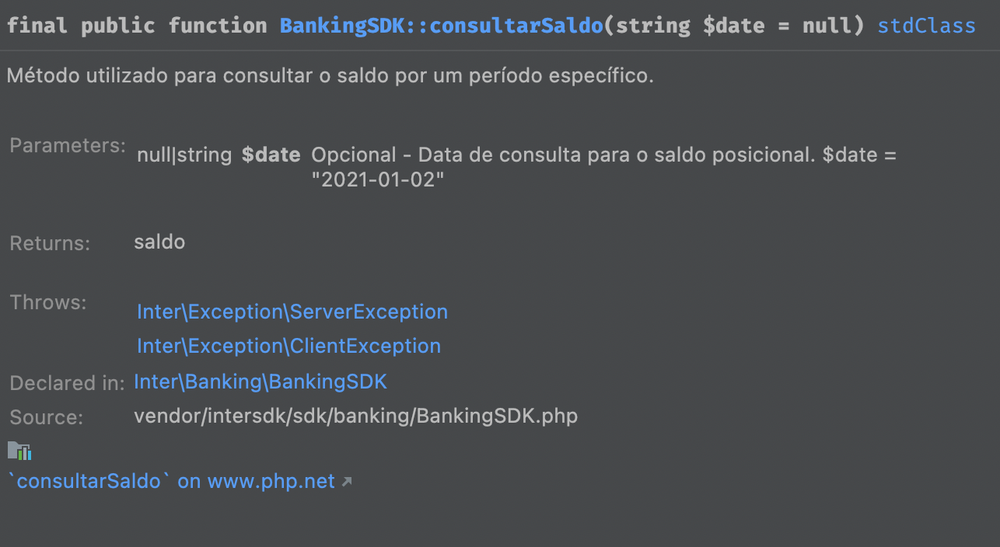

## Pré-requisitos

- Versão 7.2 do PHP ou superior.
- Versão 7 do GuzzleHttp ou superior.

## Download e configuração do InterSdk

Baixar o InterSdk do PHP no seguinte link: [SDK PHP](https://developers.uatbi.com.br/media/inter-sdk-php.zip)

Para usar o InterSdk, você deve descompactar o arquivo baixado e colocar dentro do projeto da sua aplicação.

## Download e configuração do certificado digital

Para baixar o seu certificado, siga as instruções desse
documento: [Onde Obter o Certificado](https://developers.bancointer.com.br/v4/docs/onde-obter-o-certificado)

Para usar o certificado - *arquivos .crt e .key baixados conforme instrução acima* - basta colocá-los dentro do projeto
da sua aplicação.

## Como utilizar e recursos do InterSdk

### Inicialização

Antes de executar os comandos disponibilizados pelo InterSdk, é necessário inicializa-lo. Para isso, basta passar os
seguintes parâmetros no construtor:

```injectablephp
$interSdk = new InterSdk(
    "CLIENT_ID", // Pode ser obtido no detalhe da tela de aplicações do Internet Banking
    "CLIENT_SECRET", // Pode ser obtido no detalhe da tela de aplicações no Internet Banking
    "CAMINHO_ARQUIVO_CRT", // Caminho do arquivo .crt
    "CAMINHO_ARQUIVO_KEY" // Caminho do arquivo .key
);

// EXEMPLO:

$interSdk = new InterSdk(    
    "2179676f-3069-44de-96c3-07739bcded35",
    "29f8fe86-efab-4b31-a5f6-6d22ebcb2014",
    "certs/Inter API_Certificado.crt",
    "certs/Inter API_Chave.key"
);
```

### Tratamento de erros

Em caso de erros, todos os métodos do InterSdk lançam exceções. Dessa forma, se a chamada do método passar sem exceções,
pode-se considerar que foi uma chamada com sucesso.

As exceções podem ser separadas em dois grupos: _SdkException_ e _outras exceções_.

Todas as exceções descendentes da SdkException terão um objeto de erro. Esse objeto terá título, detalhe, data e uma
lista de violações:

```injectablephp
class Erro
{
    public $title;
    public $detail;
    public $timestamp;
    public $message;
    public $correlationId;
    public $violacoes = [];
    
    ...
}

class Violacao
{
    public $razao;
    public $propriedade;
    public $valor;
    
    ...
}
```

Exemplo de tratamento de erros:

```injectablephp
class ConsultarSaldoExemplo
{
    public static function consultarSaldoCorrente(string $clientId, string $clientSecret, string $certificado, string $senha)
    {
        try {
            $interSdk = new InterSdk($clientId, $clientSecret, $certificado, $senha);
            $saldo = $interSdk->banking()->consultarSaldo();
            return $saldo;
        } catch (SdkException $e) {
            TrataErro::exemploTrataErro($e);
        }
    }
}

class TrataErro
{
    public static function exemploTrataErro(SdkException $e): void
    {
        echo "Message Erro:" . $e->getMessage();
        echo "Objeto de Erro:" . json_encode($e->getErro(), JSON_UNESCAPED_UNICODE);
        echo "Objeto de Erro Message:" . json_encode($e->getErro()->getMessage(), JSON_UNESCAPED_UNICODE);
        echo "Objeto de Erro Titulo:" . json_encode($e->getErro()->getTitle(), JSON_UNESCAPED_UNICODE);
        echo "Objeto de Erro Detalhes:" . json_encode($e->getErro()->getDetail(), JSON_UNESCAPED_UNICODE);
        echo "Objeto de Erro Violacoes:" . json_encode($e->getErro()->getViolacoes(), JSON_UNESCAPED_UNICODE);
        echo "Exceção Completa: " . $e;
    }
}
```

### Múltiplas contas

Caso sua aplicação seja associada a mais de uma conta, você poderá a qualquer momento mudar e consultar a conta que será
utilizada pelo InterSdk.

```injectablephp
use inter\InterSdk;

include_once 'vendor/autoload.php';
include_once 'vendor/intersdk/sdk/InterSdk.php';

class MultiplasContas
{
    public function exemplo(string $clientId, string $clientSecret, string $certificado, string $senha)
    {
        $interSdk = new InterSdk($clientId, $clientSecret, $certificado, $ambiente);
        
        $interSdk->setContaCorrente("123456");
        // Executa comandos na conta selecionada
        $saldo = $interSdk->banking()->consultarSaldo();
        
        $interSdk->setContaCorrente("098765");
        // Executa comandos na nova conta selecionada
        $extrato = $interSdk->banking()->consultarExtrato("2023-01-01", "2023-01-15");
    }
}
```

### Geração de logs

O InterSdk grava logs dos comandos executados, com o objetivo de auxiliar na identificação de possíveis erros.

Os arquivos de log ficam armazenados na pasta "logs", dentro do diretório de execução da aplicação. Se a pasta "logs"
não existir ela será criada automaticamente.

Será criado um arquivo de log para cada dia da semana. O log de 7 dias atrás será sempre removido no primeiro acesso do
dia, sendo assim, a pasta poderá ter até 7 arquivos de log.

Ex: inter-sdk-log-14-03-2023.txt, inter-sdk-log-15-03-2023.txt

### Modo debug

O modo debug por padrão é desabilitado.

Se o modo debug estiver habilitado, os logs gerados conterão as requisições e as respostas das chamadas das APIs do
Inter que são feitas internamente pelo InterSdk.

Para habilitar/desabilitar basta executar o seguinte método:

```injectablephp
$interSdk->setDebug(true);// Habilita modo debug
```

### Controle de rate limit

Os endpoints das APIs do inter tem um limite máximo de chamadas permitidas por minuto(rate limit).

Se esse limite for ultrapassado, o InterSdk vai retornar o seguinte erro:

```injectablephp
title="HTTP/1.1 429 Too Many Requests"
```

O InterSdk tem um controle automático para rate limit. Caso o rate limit seja excedido, o InterSdk vai identificar o
erro, esperar um minuto e então vai tentar novamente.

O controle de rate limit por padrão está habilitado. Para desabilitar/reabilitar basta utilizar o seguinte comando:

```injectablephp
$interSdk->setControleRateLimit(false);
```

### Paginação

Algumas operações retornam uma lista de resultados, por exemplo, a consulta de extrato enriquecido.

Para essas operações, o InterSdk terá 2 modos diferentes, um com paginação e um sem paginação.

No caso de uma chamada sem paginação, a aplicação só precisa chamar o método uma vez, e essa chamada vai retornar o
resultado completo.

No caso da chamada com paginação, o método vai retornar um objeto contendo informações de paginação e uma página de
resultados. A aplicação deverá verificar se tem mais páginas para ler, e então poderá chamar o método novamente para ler
a próxima página.
A cada chamada, a aplicação deverá incrementar o parâmetro de paginação correspondente.

Todos os métodos que possuem paginação possuem o campo buscaPaginada. Se esse campo for falso o método retorna a busca
completa de um vez.

Exemplo de chamada sem paginação:

```injectablephp
$transacoes = interSdk->banking()->consultarExtratoEnriquecido(false, $dataInicio, $dataFim);
```

Exemplo de chamada com paginação:

```injectablephp
$continue = true;
$page = 0;
$tamanho = 10000;
$trasancoes = [];

while ($continue) {
    $response = interSdk->banking()->consultarExtratoEnriquecido(true, $dataInicio, $dataFim, null, null, $page, $tamanho);

    $trasancoes = array_merge((array)$trasancoes, (array)$response->transacoes);

    if ($response->ultimaPagina || $response->totalPaginas == 0) {
        $continue = false;
    }
    ++$page;
}
```

### Avisos

O InterSdk possui uma lista de avisos.

Os avisos tem o objetivo de prever problemas futuros, por exemplo, se o certificado digital estiver próximo de expirar,
o InterSdk vai gerar um aviso para isso.

```injectablephp
use inter\InterSdk;

include_once 'vendor/autoload.php';
include_once 'vendor/intersdk/sdk/InterSdk.php';

class Avisos
{
    public function exemplo(string $clientId, string $clientSecret, string $certificado, string $senha)
    {
        $interSdk = new InterSdk($clientId, $clientSecret, $certificado, $ambiente);
        $avisos = $interSdk->getAvisos();
        var_dump($avisos);
    }
}
```

### PHPDoc:

Todos os métodos do InterSdk são documentados com PHPDoc.

Com a documentação phpdoc, você pode ter acesso a informações detalhadas sobre o método apenas posicionando o mouse
sobre o método (ver documentação da sua IDE).



## Projeto exemplo

### Código e documentação dos exemplos de uso do InterSdk

Disponibilizamos um projeto de exemplo nesse link: [DEMO PHP](https://developers.uatbi.com.br/media/demo-sdk-php.zip). O objetivo dele é
mostrar as funcionalidades do InterSdk, bem como
a utilização e execução dos seus métodos.
